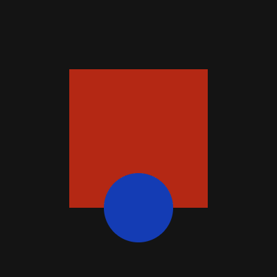
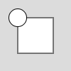
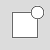
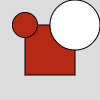
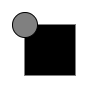

# p5 \<marker>

A [p5.js](https://p5js.org) wrapper for sketching declaratively in XML

## Contents

- [Motivation](#motivation)
- [Syntax](#syntax)
- [Core Concepts](#core-concepts)
  - [Elements](#elements)
  - [Attributes](#attributes)
  - [Functions](#functions)
- [Reference (under construction)](https://p5-marker-docs.glitch.me)

## Motivation

As a creative coding instructor, I have noticed a few things that beginners often find counterintuitive.

Take this example:



In English, I might describe this as "a large rotating red square with a small blue circle in front of it."

To produce it in p5.js, I need to break that down into a series of steps to produce it:

```
let squareAngle = 0;

function setup() {
  createCanvas(400, 400);
  angleMode(DEGREES);
  noStroke();
}

function draw() {
  background(20);
  push();
  translate(width / 2, height/2);
  rotate(squareAngle);
  fill(180, 40, 20);
  rectMode(CENTER);
  square(0, 0, 200);
  squareAngle = squareAngle + 2;
  pop();
  fill(20, 60, 180);
  circle(width / 2, height * 0.75, 100);
}
```

Given the simplicity of the resulting image, I think there are a surprising number of concepts that need to be introduced in order to produce it. Without intentional code organization, I think it's quite easy to lose track of which styling/transformations will affect which things on the canvas.

Here's how to produce that same example in Marker:

```
<canvas
  width="400"
  height="400"
  square_angle="0"
  angle_mode="DEGREES"
  canvas_background="20"
  stroke_color="NONE"
>
  <square
    x="width/2"
    y="height/2"
    s="200"
    rect_mode="CENTER"
    fill_color="180, 40, 20"
    angle="square_angle"
    square_angle="square_angle + 1"
  />
  <circle x="width/2" y="height * 0.75" d="100" fill_color="20, 60, 180" />
</canvas>
```

My goal is to provide a way to create sketches based on what you want to see, rather than how to produce it. Marker uses XML for its declarative syntax.

For folks who want a foundation to build towards more complex imperative programming languages, the implementations of Processing in [Java](https://processing.org/), [JavaScript](https://p5js.org/), and [Python](https://py.processing.org/) work fabulously.

My target audience for Marker are folks focused on creative work, rather than learning programming concepts.

## Syntax

Attribute values are evaluated as JavaScript, so JS syntax applies.

All names are written in snake case, which looks_like_this: all lowercase with words separated by underscores. This is because DOM attributes are case insensitive.

## Core concepts

### Elements

The canvas and everything that appears on it are represented by elements.

The general rule is that p5.js methods that render something to the canvas have a corresponding element.

For situations in which it's helpful to have an invisible element, you can use the blank <\_> element.

Examples:

- \<square>
- \<text>
- \<image>

### Attributes

Style settings, transformations, parameters, and variables are all represented by attributes.

The general rule is that the required parameters for a p5.js method are required attributes on its corresponding Marker element.

For example, the square() p5.js method requires x, y, and s parameters, so the \<square> Marker elements, requires attributes with those same names:

```
<square x="100" y="100" s="50" />
```

Attributes are passed down to an element's children.

```
<square x="100" y="100" s="50">
  <circle d="25" />
</square>
```



You can reference attributes from parents (grandparents, etc.).

```
<square x="25" y="25" s="50">
  <circle x="x + 50" d="25" />
</square>
```



Attributes can be set to multiple values, separated by commas.

```
<square x="25" y="25" s="50" fill_color="180, 40, 20">
  <circle d="25" />
</square>
<circle x="75" y="25" d="50" />
```



### Functions

Functions are called within attribute values to calculate a value.

p5.js functions that return a value, rather than render something to the canvas, have a snake case alias.

```
<canvas width="100" height="100" canvas_background="255">
  <square x="25" y="25" s="50" fill_color="0">
    <circle d="25" fill_color="lerp_color(fill_color, canvas_background, 0.5)"/>
  </square>
</canvas>
```


